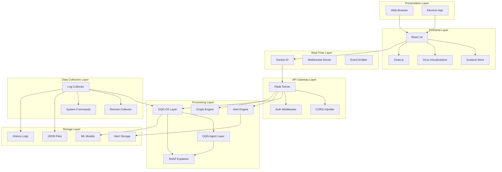

# Architecture Overview

Kaisen follows a modern, layered architecture designed for scalability, real-time processing, and ease of maintenance. This document provides a comprehensive overview of the system architecture.

## High-Level Architecture



## Layer Details

### 1. Presentation Layer

**Components:**
- **Web Browser**: Access via http://localhost:5173
- **Electron App**: Standalone desktop application

**Responsibilities:**
- User interface rendering
- User input handling
- Session management

### 2. Frontend Layer

**Components:**
- **React 18**: UI component library
- **Zustand**: State management
- **D3.js**: Attack graph visualizations
- **Chart.js**: Real-time metric charts
- **Material UI**: Component styling

**Responsibilities:**
- Dashboard rendering
- Real-time data display
- User interactions
- Chart and graph rendering

### 3. API Gateway Layer

**Components:**
- **Flask Server**: REST API endpoints
- **CORS Handler**: Cross-origin request handling
- **Auth Middleware**: Authentication and authorization

**Key Endpoints:**
- `GET /api/health` - Health check
- `GET /api/metrics/latest` - Latest metrics
- `GET /api/metrics/history` - Historical data
- `GET /api/alerts` - Security alerts
- `GET /api/attack-graph` - Attack graph data
- `GET /api/stats` - System statistics

### 4. Real-Time Layer

**Components:**
- **Socket.IO**: WebSocket communication
- **Event Emitter**: Real-time event broadcasting

**Events:**
- `metrics_update` - New metrics available
- `new_alert` - New security alert
- `attack_graph_update` - Attack graph changed
- `ip_update` - New suspicious IP detected

### 5. Processing Layer

**Components:**

#### DQN OS Layer (src/agent.py)
- **State Space**: 13 features (CPU, Memory, Processes, Network, IPs, lateral movement)
- **Action Space**: 5 actions (block IP, lock account, terminate process, isolate host, no action)
- **Model**: Deep Q-Network with experience replay
- **Training**: 994 episodes, 66,178 steps

#### DQN Agent Layer (src/agent_response_env.py)
- **State Space**: 12D session observation
- **Action Space**: 5 interventions (do_nothing, rate_limit, inject_prompt, escalate, terminate)
- **Arbitration**: Cross-layer detection

#### SHAP Explainer (src/shap_explain.py)
- **Purpose**: Explain AI decisions in natural language
- **Method**: KernelExplainer for model-agnostic explanations
- **Output**: Human-readable reasoning for alerts

#### Alert Engine (src/alert_engine.py)
- **Purpose**: Generate security alerts from anomalies
- **Thresholds**: Configurable severity levels
- **Deduplication**: Prevents alert spam

#### Graph Engine (src/graph_engine.py)
- **Purpose**: Build attack graph from collected data
- **Visualization**: D3.js force-directed graph
- **Analysis**: Path finding and risk scoring

### 6. Data Collection Layer

**Components:**

#### Log Collector (src/log_collector.py)
- **Purpose**: Collect system metrics locally
- **Interval**: 7 seconds (configurable)
- **Metrics**: CPU, Memory, Processes, Network, Failed Logins, IP tracking
- **Commands**: WMIC, PowerShell, netstat (Windows); ps, netstat, who (Linux)

#### Remote Collector (src/remote_log_collector.py)
- **Purpose**: Collect from remote systems
- **Protocol**: HTTP/HTTPS
- **Authentication**: Token-based
- **Compression**: Gzip for bandwidth efficiency

#### System Commands (src/terminal_executor.py)
- **Purpose**: Execute system commands securely
- **Timeout**: Configurable command timeout
- **Safety**: Whitelist-based command filtering
- **Error Handling**: Retry logic and fallback

### 7. Storage Layer

**Components:**

#### JSON Files
- **Purpose**: Primary data storage
- **Location**: `Backend/minip/logs/`
- **Files**:
  - `history.json` - All metrics history
  - `alerts.json` - Security alerts
  - `attack_graph.json` - Attack graph data
  - `collected_graph.json` - Collected graph data

#### History Logs
- **Format**: JSON array of metric objects
- **Retention**: Configurable (default 30 days)
- **Rotation**: Automatic file rotation based on size

#### Alert Storage
- **Format**: JSON array of alert objects
- **Retention**: Long-term storage (90 days default)
- **Deduplication**: Prevents duplicate storage

#### ML Models
- **Location**: `Backend/minip/models/`
- **Files**:
  - `best_model.h5` - Trained DQN weights
  - `best_model_meta.json` - Model metadata
  - `checkpoint_*.h5` - Training checkpoints
- **Format**: TensorFlow SavedModel / HDF5

## Data Flow

### Metric Collection Flow

```
┌─────────────────┐
│  Log Collector  │ ← Executes system commands
│  (7s interval)  │ ← Collects CPU, Memory, etc.
└────────┬────────┘
         │
         ↓
┌─────────────────┐
│  DQN Agent      │ ← Analyzes for anomalies
│  (inference)    │ ← Generates risk score
└────────┬────────┘
         │
         ↓
┌─────────────────┐
│  Alert Engine   │ ← Checks thresholds
│  (if anomaly)   │ ← Creates alert
└────────┬────────┘
         │
         ↓
┌─────────────────┐
│  JSON Storage   │ ← Saves metrics
│  (history.json) │ ← Saves alerts
└─────────────────┘
```

### Frontend Data Flow

```
┌─────────────────┐
│  React Frontend │ ← User interface
│  (Dashboard)    │ ← Real-time charts
└────────┬────────┘
         │
         ↓ WebSocket / HTTP
┌─────────────────┐
│  Flask API      │ ← REST endpoints
│  (Port 8000)    │ ← WebSocket events
└────────┬────────┘
         │
         ↓ File I/O
┌─────────────────┐
│  JSON Logs      │ ← history.json
│  (logs/)        │ ← alerts.json
└─────────────────┘
```

## Security Architecture

### Defense in Depth

```
┌─────────────────────────────────────────┐
│           Perimeter Layer               │
│  (Firewall, Network Segmentation)      │
└─────────────────────────────────────────┘
                   │
                   ↓
┌─────────────────────────────────────────┐
│           Detection Layer               │
│  (Kaisen Monitoring, Anomaly Detection) │
└─────────────────────────────────────────┘
                   │
                   ↓
┌─────────────────────────────────────────┐
│           Response Layer                │
│  (Automated Alerts, Incident Response)  │
└─────────────────────────────────────────┘
                   │
                   ↓
┌─────────────────────────────────────────┐
│           Recovery Layer                │
│  (Backup, Restore, Documentation)     │
└─────────────────────────────────────────┘
```

### Data Security

- **Encryption in Transit**: TLS 1.3 for all API communications
- **Local Storage Only**: No data leaves your infrastructure
- **Secure Defaults**: All components run with minimal privileges
- **Audit Logging**: All actions are logged for accountability

## Scalability Architecture

### Horizontal Scaling

```
┌──────────────────────────────────────────┐
│           Load Balancer                   │
│      (Distributes traffic)                │
└──────────────────────────────────────────┘
              │
    ┌─────────┼─────────┐
    │         │         │
    ▼         ▼         ▼
┌───────┐ ┌───────┐ ┌───────┐
│Kaisen │ │Kaisen │ │Kaisen │
│Node 1 │ │Node 2 │ │Node 3 │
└───────┘ └───────┘ └───────┘
    │         │         │
    └─────────┼─────────┘
              │
    ┌─────────┴─────────┐
    │   Shared Storage   │
    │  (Redis/Database)  │
    └───────────────────┘
```

### Performance Optimizations

- **Caching**: Redis for frequently accessed data
- **Batch Processing**: Bulk log processing for efficiency
- **Lazy Loading**: Load data only when needed
- **WebSocket Pooling**: Reuse connections for efficiency
- **Compression**: Gzip for network transfers

## Deployment Architecture

### Docker Deployment (Recommended)

```yaml
# docker-compose.yml
version: '3.8'

services:
  backend:
    build: ./Backend/minip
    ports:
      - "8000:8000"
    volumes:
      - ./logs:/app/logs
    environment:
      - FLASK_ENV=production
    
  frontend:
    build: ./Frontend
    ports:
      - "5173:5173"
    depends_on:
      - backend
    environment:
      - VITE_API_URL=http://backend:8000
```

### Kubernetes Deployment

```yaml
# kaisen-deployment.yaml
apiVersion: apps/v1
kind: Deployment
metadata:
  name: kaisen-backend
spec:
  replicas: 3
  selector:
    matchLabels:
      app: kaisen-backend
  template:
    metadata:
      labels:
        app: kaisen-backend
    spec:
      containers:
      - name: backend
        image: kaisen/backend:latest
        ports:
        - containerPort: 8000
---
apiVersion: v1
kind: Service
metadata:
  name: kaisen-backend
spec:
  selector:
    app: kaisen-backend
  ports:
  - port: 8000
  type: LoadBalancer
```

## Monitoring and Observability

### Health Checks

- **Liveness Probe**: `/api/health` - Returns 200 if service is running
- **Readiness Probe**: `/api/ready` - Returns 200 if ready to accept traffic
- **Startup Probe**: `/api/startup` - Returns 200 after initialization

### Metrics

Prometheus-compatible metrics at `/metrics`:

```
# HELP kaisen_metrics_collected_total Total metrics collected
# TYPE kaisen_metrics_collected_total counter
kaisen_metrics_collected_total 12345

# HELP kaisen_alerts_generated_total Total alerts generated
# TYPE kaisen_alerts_generated_total counter
kaisen_alerts_generated_total{severity="critical"} 12
kaisen_alerts_generated_total{severity="high"} 45

# HELP kaisen_api_request_duration_seconds API request duration
# TYPE kaisen_api_request_duration_seconds histogram
kaisen_api_request_duration_seconds_bucket{le="0.1"} 1234
```

### Distributed Tracing

Jaeger-compatible tracing for request flows:

```python
# Example trace
Trace ID: 4f7d2a1b3c8e9f0d
├─ Span: api_request (45ms)
│  ├─ Span: authenticate (2ms)
│  ├─ Span: load_metrics (10ms)
│  ├─ Span: dqn_predict (25ms)
│  └─ Span: format_response (3ms)
└─ Span: websocket_emit (5ms)
```

## Summary

Kaisen's architecture is designed for:

1. **Scalability**: Horizontal scaling with load balancers and multiple nodes
2. **Reliability**: Redundancy, health checks, and graceful degradation
3. **Performance**: Caching, batching, and optimized data flows
4. **Security**: Defense in depth, encryption, and secure defaults
5. **Observability**: Comprehensive monitoring, logging, and tracing
6. **Maintainability**: Clean architecture, clear separation of concerns

For more details on specific components, see:
- [Backend Architecture](backend.md) - Deep dive into backend services
- [Frontend Architecture](frontend.md) - Frontend structure and patterns
- [API Reference](../api.md) - Complete API documentation