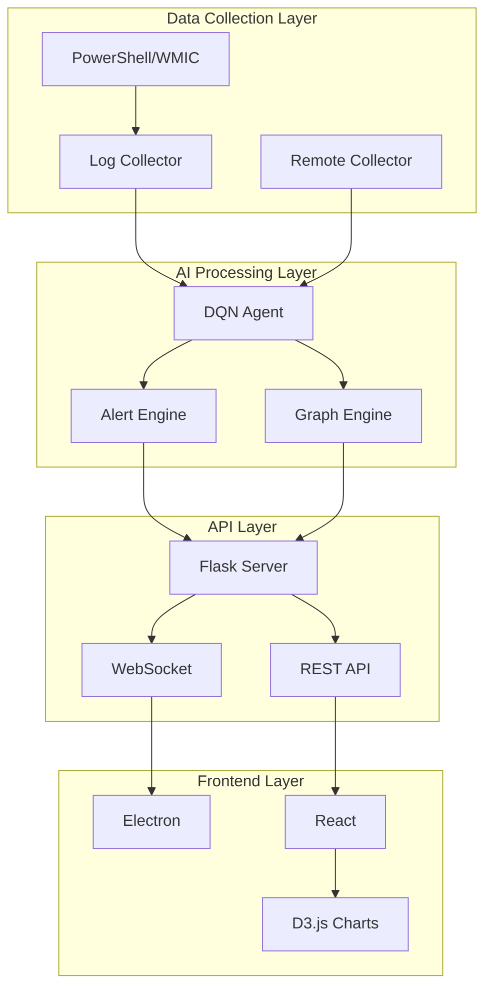

# Kaisen Documentation

Welcome to the Kaisen documentation - your comprehensive guide to the AI-Powered Security Monitoring System.

## What is Kaisen?

Kaisen is an intelligent, dual-layer security monitoring system that protects your infrastructure and LLM agents through real-time anomaly detection, automated threat analysis, and attack path visualization.


## Key Features

- **Real-Time Monitoring**: Monitor CPU, memory, processes, network connections, and failed logins with live updates every 7 seconds
- **AI-Powered Anomaly Detection**: Deep Q-Network (DQN) trained on 994 episodes for intelligent threat detection
- **Attack Graph Visualization**: Interactive D3.js graph showing attack paths and relationships
- **Suspicious IP Tracking**: Monitor and analyze suspicious IP addresses with risk scoring
- **Dual-Layer Architecture**: OS telemetry + LLM agent session monitoring
- **SHAP Explainability**: Natural language reasoning for all AI interventions

## Quick Start

Get started with Kaisen in just 3 steps:

```bash
# 1. Start Backend (in Backend/minip/)
.\start_all.bat

# 2. Start Frontend (in Frontend/)
npm run electron:dev

# 3. Access Dashboard
# Electron app opens automatically
# Or visit http://localhost:5173
```

## Architecture Overview



## Project Statistics

- **📦 ~15,000** lines of code
- **✅ 179** passing tests (unit, integration, property-based)
- **🚀 7-second** collection interval for OS metrics
- **🧠 Dual-Layer** DQN architecture
- **📊 SHAP-based** explainability
- **⚡ <100ms** API response time
- **🔄 <50ms** WebSocket latency

## Next Steps

- [Installation Guide](getting-started/installation.md) - Detailed setup instructions
- [Quick Start](getting-started/quickstart.md) - Get running in minutes
- [User Guide](user-guide/how-to-use.md) - Learn how to use Kaisen effectively
- [Architecture](architecture/overview.md) - Deep dive into system design

## Support

For issues, questions, or contributions, please refer to the troubleshooting guide or submit an issue on the project repository.